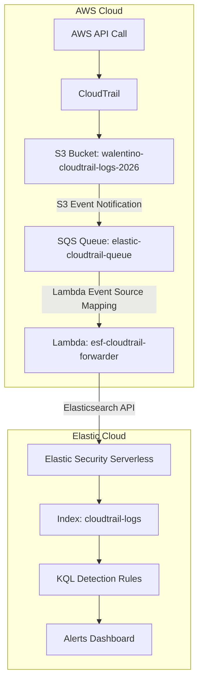

## Architecture

Phase 1: AWS Environment Setup
Objective: Establish the foundational AWS infrastructure for log generation and storage.

Component	Configuration	Purpose
AWS Account	Free Tier (457664479040)	All resources deployed in us-east-1
CloudTrail Trail	project-detection-trail	Records management events across all regions
Log Delivery S3 Bucket	walentino-cloudtrail-logs-2026	Receives compressed CloudTrail .json.gz log files
Bucket Policy	Allows cloudtrail.amazonaws.com to s3:PutObject	Grants CloudTrail permission to deliver logs
Validation:

CloudTrail trail status confirmed as "Logging"

Log files visible in S3 bucket under AWSLogs/457664479040/CloudTrail/

Downloaded and decompressed a sample log file — confirmed valid JSON with management event records
