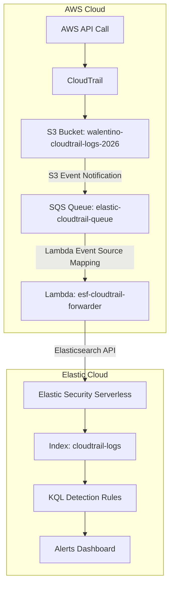

## Architecture

Phase 1: AWS Environment Setup
Objective: Establish the foundational AWS infrastructure for log generation and storage.

Component	Configuration	Purpose
AWS Account	Free Tier (457664479040)	All resources deployed in us-east-1
CloudTrail Trail	project-detection-trail	Records management events across all regions
Log Delivery S3 Bucket	walentino-cloudtrail-logs-2026	Receives compressed CloudTrail .json.gz log files
Bucket Policy	Allows cloudtrail.amazonaws.com to s3:PutObject	Grants CloudTrail permission to deliver logs
Validation:

CloudTrail trail status confirmed as "Logging"

Log files visible in S3 bucket under AWSLogs/457664479040/CloudTrail/

Downloaded and decompressed a sample log file — confirmed valid JSON with management event records

---

## Phase 1: AWS Environment Setup

**Objective:** Establish the foundational AWS infrastructure for log generation and storage.

| Component | Configuration | Purpose |
|-----------|---------------|---------|
| AWS Account | Free Tier (`457664479040`) | All resources deployed in us-east-1 |
| CloudTrail Trail | `project-detection-trail` | Records management events across all regions |
| Log Delivery S3 Bucket | `walentino-cloudtrail-logs-2026` | Receives compressed CloudTrail `.json.gz` log files |
| Bucket Policy | Allows `cloudtrail.amazonaws.com` to `s3:PutObject` | Grants CloudTrail permission to deliver logs |

**Validation:**
- CloudTrail trail status confirmed as "Logging"
- Log files visible in S3 bucket under `AWSLogs/457664479040/CloudTrail/`
- Downloaded and decompressed a sample log file — confirmed valid JSON with management event records

**Screenshots:**

---

## Phase 2: Vulnerable Resources

**Objective:** Deploy deliberately misconfigured AWS resources that simulate real-world cloud security risks. These serve as detection targets for Phase 4 rules.

### Resource 1: Public S3 Bucket

| Property | Value |
|----------|-------|
| Bucket Name | `target-data-leak-2026` |
| Public Access | Block all public access: **Off** |
| Bucket Policy | Allows `s3:GetObject` to `Principal: *` |
| Test File | `test-file.txt` ("This is a test file for detection validation") |

This simulates a common cloud misconfiguration: an S3 bucket unintentionally exposed to the internet. In a real attack, an adversary could enumerate and exfiltrate sensitive data.

### Resource 2: Over-Permissive IAM User

| Property | Value |
|----------|-------|
| User Name | `project-admin` |
| Inline Policy | `OverPermissivePolicy` |
| Allowed Actions | `iam:AttachUserPolicy` (all resources), `sts:AssumeRole` (all resources) |

This simulates an IAM user with excessive privileges. An attacker compromising these credentials could escalate to full AdministratorAccess.

**Screenshots:**

