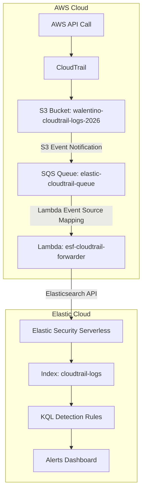

## Architecture

```mermaid
flowchart TD
    A[AWS API Call] --> B[CloudTrail]
    B --> C[S3 Bucket: walentino-cloudtrail-logs-2026]
    C -->|S3 Event Notification| D[SQS Queue: elastic-cloudtrail-queue]
    D -->|Lambda Event Source Mapping| E[Lambda: esf-cloudtrail-forwarder]
    E -->|Elasticsearch API| F[Elastic Security Serverless]
    F --> G[Index: cloudtrail-logs]
    G --> H[KQL Detection Rules]
    H --> I[Alerts Dashboard]

    subgraph AWS Cloud
        A
        B
        C
        D
        E
    end

    subgraph Elastic Cloud
        F
        G
        H
        I
    end
```
