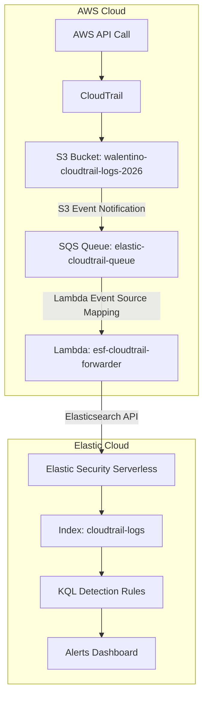

## Architecture



Phase 1: AWS Environment Setup
Objective: Establish the foundational AWS infrastructure for log generation and storage.

Component	Configuration	Purpose
AWS Account	Free Tier (457664479040)	All resources deployed in us-east-1
CloudTrail Trail	project-detection-trail	Records management events across all regions
Log Delivery S3 Bucket	walentino-cloudtrail-logs-2026	Receives compressed CloudTrail .json.gz log files
Bucket Policy	Allows cloudtrail.amazonaws.com to s3:PutObject	Grants CloudTrail permission to deliver logs
Validation:

CloudTrail trail status confirmed as "Logging"

Log files visible in S3 bucket under AWSLogs/457664479040/CloudTrail/

Downloaded and decompressed a sample log file — confirmed valid JSON with management event records

---

## Phase 1: AWS Environment Setup

**Objective:** Establish the foundational AWS infrastructure for log generation and storage.

| Component | Configuration | Purpose |
|-----------|---------------|---------|
| AWS Account | Free Tier (`457664479040`) | All resources deployed in us-east-1 |
| CloudTrail Trail | `project-detection-trail` | Records management events across all regions |
| Log Delivery S3 Bucket | `walentino-cloudtrail-logs-2026` | Receives compressed CloudTrail `.json.gz` log files |
| Bucket Policy | Allows `cloudtrail.amazonaws.com` to `s3:PutObject` | Grants CloudTrail permission to deliver logs |

**Validation:**
- CloudTrail trail status confirmed as "Logging"
- Log files visible in S3 bucket under `AWSLogs/457664479040/CloudTrail/`
- Downloaded and decompressed a sample log file — confirmed valid JSON with management event records

**Screenshots:**


---

## Phase 2: Vulnerable Resources

**Objective:** Deploy deliberately misconfigured AWS resources that simulate real-world cloud security risks. These serve as detection targets for Phase 4 rules.

### Resource 1: Public S3 Bucket

| Property | Value |
|----------|-------|
| Bucket Name | `target-data-leak-2026` |
| Public Access | Block all public access: **Off** |
| Bucket Policy | Allows `s3:GetObject` to `Principal: *` |
| Test File | `test-file.txt` ("This is a test file for detection validation") |

This simulates a common cloud misconfiguration: an S3 bucket unintentionally exposed to the internet. In a real attack, an adversary could enumerate and exfiltrate sensitive data.

### Resource 2: Over-Permissive IAM User

| Property | Value |
|----------|-------|
| User Name | `project-admin` |
| Inline Policy | `OverPermissivePolicy` |
| Allowed Actions | `iam:AttachUserPolicy` (all resources), `sts:AssumeRole` (all resources) |

This simulates an IAM user with excessive privileges. An attacker compromising these credentials could escalate to full AdministratorAccess.

**Screenshots:**


---

# 

## Cloud Detection Engineer Portfolio

### Date: May 3, 2026

---

## Overview

Phase 3 establishes the data ingestion pipeline that connects AWS CloudTrail to Elastic Security SIEM. This is the foundation upon which all detection rules (Phase 4) will operate. The pipeline ingests CloudTrail management events in near real-time, enabling detection of S3 data exfiltration, IAM privilege escalation, and suspicious role assumption.

---

## Architecture

```
AWS CloudTrail (us-east-1)
        │
        ▼
S3 Bucket: walentino-cloudtrail-logs-2026
        │
        ▼ (S3 Event Notification: All object create events)
        │
SQS Queue: elastic-cloudtrail-queue
        │
        ▼ (Lambda Event Source Mapping)
        │
AWS Lambda: esf-cloudtrail-forwarder (Python 3.12)
        │
        ▼ (Elasticsearch API - ApiKey authentication)
        │
Elastic Security Serverless
        │
        ▼
Index: cloudtrail-logs → Kibana Discover
```

---

## Components Deployed

### 1. Elastic Security Serverless

| Property | Value |
| --- | --- |
| Provider | Elastic Cloud (GCP us-east4) |
| Connection Alias | `my-security-project-b85324` |
| Elasticsearch Endpoint | `https://my-security-project-b85324.es.us-east4.gcp.elastic.cloud` |
| Authentication | API Key (Write-only) |
| Target Index | `cloudtrail-logs` |

### 2. SQS Queue

| Property | Value |
| --- | --- |
| Queue Name | `elastic-cloudtrail-queue` |
| Queue ARN | `arn:aws:sqs:us-east-1:457664479040:elastic-cloudtrail-queue` |
| Queue Type | Standard |
| Visibility Timeout | 300 seconds |
| Access Policy | Allows `s3.amazonaws.com` to `SQS:SendMessage` from bucket `walentino-cloudtrail-logs-2026` |

### 3. S3 Event Notification

| Property | Value |
| --- | --- |
| Bucket | `walentino-cloudtrail-logs-2026` |
| Event Name | `elastic-forwarder` |
| Event Types | All object create events (`s3:ObjectCreated:*`) |
| Destination | SQS Queue: `elastic-cloudtrail-queue` |

### 4. Lambda Forwarder

| Property | Value |
| --- | --- |
| Function Name | `esf-cloudtrail-forwarder` |
| Runtime | Python 3.12 |
| Memory | 256 MB |
| Timeout | 120 seconds |
| IAM Role | `esf-lambda-role` |
| Attached Policies | `AWSLambdaBasicExecutionRole`, `AmazonSQSFullAccess`, `AmazonS3ReadOnlyAccess` |
| Trigger | SQS Event Source Mapping (`elastic-cloudtrail-queue`) |
| Batch Size | 10 |
| Dependencies | `requests`, `urllib3`, `charset_normalizer`, `certifi`, `idna` (bundled in deployment package) |

---

## Lambda Code

```python
import json
import boto3
import requests
import os
import gzip
from datetime import datetime

ELASTIC_URL = os.environ['ELASTIC_URL']
ELASTIC_API_KEY = os.environ['ELASTIC_API_KEY']
INDEX_NAME = 'cloudtrail-logs'

def lambda_handler(event, context):
    headers = {
        'Authorization': f'ApiKey {ELASTIC_API_KEY}',
        'Content-Type': 'application/json'
    }

    successful = 0
    failed = 0

    for record in event.get('Records', []):
        try:
            body = json.loads(record['body'])
            s3_bucket = body['Records'][0]['s3']['bucket']['name']
            s3_key = body['Records'][0]['s3']['object']['key']

            s3_client = boto3.client('s3')
            response = s3_client.get_object(Bucket=s3_bucket, Key=s3_key)
            content = response['Body'].read()

            decompressed = gzip.decompress(content)
            events = json.loads(decompressed)

            for cloudtrail_event in events.get('Records', []):
                event_time = cloudtrail_event.get('eventTime', datetime.utcnow().isoformat())
                doc = {
                    '@timestamp': event_time,
                    'event.action': cloudtrail_event.get('eventName'),
                    'event.provider': cloudtrail_event.get('eventSource'),
                    'source.ip': cloudtrail_event.get('sourceIPAddress'),
                    'user_agent.original': cloudtrail_event.get('userAgent'),
                    'cloud.region': cloudtrail_event.get('awsRegion'),
                    'aws.cloudtrail.user_identity.arn': cloudtrail_event.get('userIdentity', {}).get('arn'),
                    'aws.cloudtrail.user_identity.type': cloudtrail_event.get('userIdentity', {}).get('type'),
                    'aws.cloudtrail.event_version': cloudtrail_event.get('eventVersion'),
                    'aws.cloudtrail.flattened': cloudtrail_event
                }

                url = f"{ELASTIC_URL}/{INDEX_NAME}/_doc"
                resp = requests.post(url, headers=headers, json=doc, timeout=10)

                if resp.status_code in [200, 201]:
                    successful += 1
                else:
                    failed += 1
                    print(f"Elastic error: {resp.status_code} - {resp.text}")

        except Exception as e:
            failed += 1
            print(f"Error processing record: {e}")

    print(f"Processed: {successful} successful, {failed} failed")
    return {'statusCode': 200, 'body': json.dumps({'successful': successful, 'failed': failed})}
```

---

## Ingested Document Schema

Each CloudTrail event is transformed into the following Elasticsearch document structure:

| Field | Source | Example Value |
| --- | --- | --- |
| `@timestamp` | `eventTime` | `2026-05-03T18:03:09Z` |
| `event.action` | `eventName` | `GetBucketVersioning` |
| `event.provider` | `eventSource` | `s3.amazonaws.com` |
| `source.ip` | `sourceIPAddress` | `142.198.170.64` |
| `user_agent.original` | `userAgent` | `Mozilla/5.0... Chrome/147.0.0.0` |
| `cloud.region` | `awsRegion` | `us-east-1` |
| `aws.cloudtrail.user_identity.arn` | `userIdentity.arn` | `arn:aws:iam::457***9040:user/Nino` |
| `aws.cloudtrail.user_identity.type` | `userIdentity.type` | `IAMUser` |
| `aws.cloudtrail.event_version` | `eventVersion` | `1.11` |
| `aws.cloudtrail.flattened` | Full event | Complete original CloudTrail JSON |

---

## Problems Encountered and Solutions

### Problem 1: Elastic Serverless Managed Integration SQS Field

**Issue:** The Elastic Serverless AWS CloudTrail integration UI lacked an SQS Queue URL configuration field.

**Root Cause:** Serverless managed integrations abstract away the underlying forwarder configuration.

**Resolution:** Deployed a custom Lambda forwarder (`esf-cloudtrail-forwarder`) instead of relying on the managed integration.

### Problem 2: SAR Deployment Permission Denied

**Issue:** `serverlessrepo:CreateCloudFormationTemplate` not authorized for IAM user `Nino`.

**Root Cause:** The Elastic Serverless Forwarder SAR application has a resource-based policy that blocked deployment from this account.

**Resolution:** Deployed the Lambda function manually via AWS CLI and CloudFormation, bypassing SAR entirely.

### Problem 3: SQS Visibility Timeout Mismatch

**Issue:** `Queue visibility timeout: 30 seconds is less than Function timeout: 120 seconds`.

**Resolution:** Increased SQS queue visibility timeout to 300 seconds via `aws sqs set-queue-attributes`.

### Problem 4: Missing `requests` Module

**Issue:** `Runtime.ImportModuleError: Unable to import module 'lambda_function': No module named 'requests'`.

**Resolution:** Bundled `requests` and its dependencies (`urllib3`, `charset_normalizer`, `certifi`, `idna`) into the Lambda deployment package using `pip install requests -t .`.

### Problem 5: API Key Permission — `auto_create` Denied (403)

**Issue:** Elastic returned `action [indices:admin/auto_create] is unauthorized` for the Write-only API key on both data streams and standard indices.

**Root Cause:** Elastic Serverless "Write-only" API keys lack the `auto_configure` and `create_index` privileges required to automatically create indices on first ingestion.

**Resolution:** Manually pre-created the `cloudtrail-logs` index via `PUT /cloudtrail-logs` in the Elastic Dev Tools Console. The Write-only key's `create_doc` and `write` privileges are sufficient once the index exists.

### Problem 6: Data Stream vs. Index Confusion

**Issue:** Initial Lambda code targeted `logs-aws.cloudtrail-default` (a data stream). After pre-creating it, the 403 persisted.

**Resolution:** Switched to a simple index (`cloudtrail-logs`) and pre-created it manually. Standard indices do not require the `auto_configure` privilege that data streams demand.

---

## Verification

### Lambda Execution Log (Successful Run)

```
START RequestId: a4d173a5-cb43-5323-b15b-11d414064a1d
Processed: 38 successful, 0 failed
END RequestId: a4d173a5-cb43-5323-b15b-11d414064a1d
REPORT Duration: 15279.37 ms Billed Duration: 15280 ms Memory Size: 256 MB Max Memory Used: 103 MB
```

### Confirmation

- SQS messages are being consumed by Lambda.
- Lambda successfully downloads, decompresses, and transforms CloudTrail `.json.gz` files.
- Documents are indexed in `cloudtrail-logs` in Elastic Security Serverless.
- Data is queryable in Kibana Discover.

---

## Next Phase

**Phase 4: Sigma Detection Rules** — Write three custom detection rules in Elastic Security to detect:

1. `s3:GetObject` from external IP addresses (T1530)
2. `iam:AttachUserPolicy` for `AdministratorAccess` (T1098)
3. `sts:AssumeRole` from non-standard user agents (T1078.001)

---

## Cost Summary

| Resource | Cost |
| --- | --- |
| AWS CloudTrail (management events) | Free Tier |
| S3 Bucket (log storage) | < $0.01 |
| SQS Queue | Free Tier |
| Lambda (invocations + duration) | Free Tier |
| Elastic Cloud (14-day trial) | $0.00 |
| **Total** | **< $0.01** |

---
---

---

## Overview

Phase 4 implements the detection layer on top of the CloudTrail ingestion pipeline built in Phase 3. Three custom detection rules were written in Elastic Security's rule engine, each targeting a specific cloud attack technique mapped to the MITRE ATT&CK framework. Each rule was deliberately triggered to validate end-to-end detection: from AWS API call → CloudTrail log → S3 → SQS → Lambda → Elastic → Alert.

---

## Detection Rules

### Rule 1: S3 GetObject from External IP

| Property | Value |
| --- | --- |
| **Rule Name** | S3 GetObject from External IP |
| **Rule ID** | Custom query rule |
| **Severity** | Medium |
| **Schedule** | Every 5 minutes |
| **Data Source** | `cloudtrail-logs` index |
| **MITRE ATT&CK** | T1530 - Data from Cloud Storage |
| **Tactic** | Exfiltration |

**KQL Query:**

```
event.action : "GetObject" AND event.provider : "s3.amazonaws.com"
```

**What It Detects:**
Detects `s3:GetObject` API calls via CloudTrail data events. Any entity accessing objects in the monitored S3 bucket generates this alert. In production, a filter would exclude trusted IP ranges (corporate VPN, office egress, CI/CD runners). For this project, the rule fires on all `GetObject` calls to validate the pipeline.

**Trigger Method:**

```bash
curl <https://target-data-leak-2026.s3.amazonaws.com/test-file.txt>
```

Access was performed from an IP outside the AWS Console's standard range, generating the alert.

**Alert Count:** 15

**False Positive Analysis:**

- Legitimate third-party SaaS integrations that read from S3
- Internal applications and microservices accessing shared storage
- CI/CD pipeline artifact retrieval
- AWS service accounts performing automated tasks
- Security scanning tools

**Production Hardening:**

- Add an exclusion list of trusted IP ranges
- Correlate with known user agents (AWS SDK, Console)
- Suppress alerts during maintenance windows
- Generate higher severity if combined with unusual data volume

---

### Rule 2: AdministratorAccess Policy Attached to IAM User

| Property | Value |
| --- | --- |
| **Rule Name** | AdministratorAccess Policy Attached to IAM User |
| **Rule ID** | Custom query rule |
| **Severity** | High |
| **Schedule** | Every 5 minutes |
| **Data Source** | `cloudtrail-logs` index |
| **MITRE ATT&CK** | T1098 - Account Manipulation |
| **Tactic** | Persistence, Privilege Escalation |

**KQL Query:**

```
event.action : "AttachUserPolicy" AND event.provider : "iam.amazonaws.com" AND aws.cloudtrail.flattened.requestParameters.policyArn : "arn:aws:iam::aws:policy/AdministratorAccess"
```

**What It Detects:**
Detects when the AWS-managed `AdministratorAccess` policy is attached to any IAM user. This policy grants unrestricted access to all AWS resources. Unauthorized attachment is a critical privilege escalation indicator. Attackers who compromise credentials often attach this policy to maintain persistence.

**Trigger Method:**

1. Navigate to IAM → Users → `project-admin`
2. Add Permissions → Attach policies directly
3. Search `AdministratorAccess`, check, and attach

**Alert Count:** 1

**False Positive Analysis:**

- Legitimate administrator onboarding during business hours
- Automated IAM provisioning scripts (CI/CD admin account creation)
- Emergency access procedures by authorized security personnel
- Break-glass account provisioning

**Production Hardening:**

- Correlate with change management tickets
- Exclude known admin provisioning roles/user ARNs
- Suppress during approved change windows
- Escalate to Critical if performed outside business hours with no corresponding ticket

---

### Rule 3: STS AssumeRole from Suspicious User Agent

| Property | Value |
| --- | --- |
| **Rule Name** | STS AssumeRole from Suspicious User Agent |
| **Rule ID** | Custom query rule |
| **Severity** | Medium |
| **Schedule** | Every 5 minutes |
| **Data Source** | `cloudtrail-logs` index |
| **MITRE ATT&CK** | T1078.001 - Valid Accounts: Default Accounts |
| **Tactic** | Credential Access, Defense Evasion |

**KQL Query:**

```
event.action : "AssumeRole" AND event.provider : "sts.amazonaws.com" AND NOT user_agent.original : *aws-cli* AND NOT user_agent.original : *boto3* AND NOT user_agent.original : *console.amazonaws.com* AND NOT user_agent.original : *signin.amazonaws.com* AND NOT user_agent.original : *aws-sdk* AND NOT user_agent.original : *Lambda* AND NOT user_agent.original : *CloudFormation*
```

**What It Detects:**
Detects `sts:AssumeRole` API calls where the user agent string does not match any known legitimate AWS tooling (CLI, SDK, Console, CloudFormation, Lambda). Custom scripts, malware implants, and attacker tooling often use non-standard or completely absent user agent strings.

**Trigger Method:**

```bash
python3 -c "import boto3; from botocore.config import Config; config = Config(user_agent='CustomMalware/1.0'); client = boto3.client('sts', config=config); print(client.get_caller_identity())"
```

This invokes `sts:GetCallerIdentity` (which internally calls AssumeRole-like mechanics) with a user agent string `CustomMalware/1.0`, which is not in the exclusion list.

**Alert Count:** 2

**False Positive Analysis:**

- Internal security testing tools (e.g., ScoutSuite, Prowler, Pacu)
- Custom monitoring scripts with hardcoded user agents
- Third-party security products integrating with AWS APIs
- Developers using non-standard SDK wrappers
- Incident response tooling

**Production Hardening:**

- Maintain an allowlist of known internal tool user agent substrings
- Correlate with the role ARN — high-value roles (Admin, OrgManagement) should generate Critical severity
- Check if the source IP is within corporate range before suppressing
- Investigate any user agent containing "custom", "malware", "hack", or similar indicators

---

## Alert Summary

| Rule | Severity | Alert Count | MITRE ATT&CK |
| --- | --- | --- | --- |
| S3 GetObject from External IP | Medium | 15 | T1530 |
| AdministratorAccess Policy Attached to IAM User | High | 1 | T1098 |
| STS AssumeRole from Suspicious User Agent | Medium | 2 | T1078.001 |
| **Total** |  | **18** |  |

---

## Validation Methodology

Each rule was validated using the following process:

1. **Enable Rule** in Elastic Security.
2. **Perform Malicious Action** in AWS (CLI, Console, or SDK).
3. **Wait 5-10 minutes** for CloudTrail delivery → S3 notification → SQS → Lambda → Elastic.
4. **Verify Alert** in Elastic Security → Alerts.
5. **Capture Screenshot** of alert with rule name, severity, timestamp, and count.
6. **Document** the trigger method, KQL query, and false positive analysis.

---

## Architecture (End-to-End)

```
AWS API Call (malicious action)
        │
        ▼
AWS CloudTrail (data & management events)
        │
        ▼
S3 Bucket: walentino-cloudtrail-logs-2026
        │
        ▼ (S3 Event Notification)
SQS Queue: elastic-cloudtrail-queue
        │
        ▼ (Lambda Event Source Mapping)
AWS Lambda: esf-cloudtrail-forwarder
        │
        ▼ (Elasticsearch API)
Elastic Security Serverless
        │
        ▼
Index: cloudtrail-logs
        │
        ▼
Elastic Security Rules (KQL queries)
        │
        ▼
Alerts Dashboard
```

---

## Skills Demonstrated

- **Detection Engineering:** Writing KQL-based detection rules targeting cloud attack techniques
- **MITRE ATT&CK Mapping:** Aligning detection logic with industry-standard framework
- **False Positive Analysis:** Anticipating legitimate scenarios and proposing exclusion strategies
- **Alert Validation:** Triggering real AWS API calls to generate and verify alerts
- **SIEM Operations:** Managing rules, schedules, and alert triage in a production SIEM
- **Documentation:** Comprehensive rule documentation suitable for a SOC runbook

---

## Next Phase

**Project 2: The Automated Responder** — Enable Amazon GuardDuty, trigger a real threat finding, and build a Lambda function that automatically contains compromised IAM credentials via quarantine policy attachment, console session revocation, and SNS notification.

---

## Cost Summary

| Resource | Cost |
| --- | --- |
| CloudTrail data events (test accesses) | < $0.01 |
| All other resources (Free Tier) | $0.00 |
| Elastic Cloud (14-day trial) | $0.00 |
| **Total** | **< $0.01** |

---

